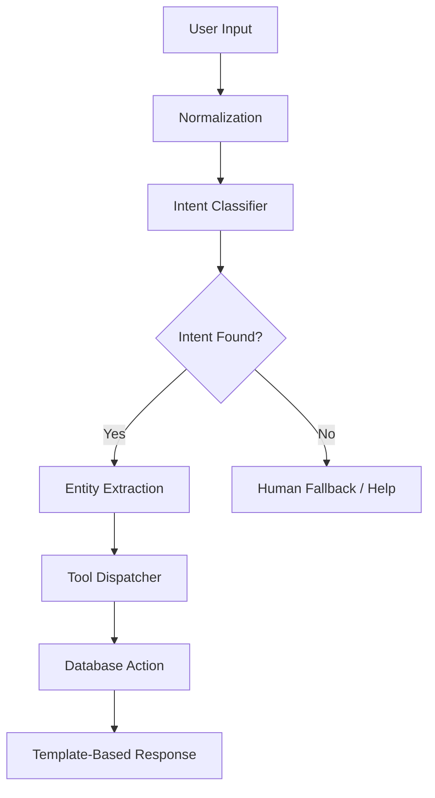

# 🧠 Implementation Plan: Local Intent-Action Engine

This plan outlines how to build the **AI Store Assistant** functionality without using expensive LLM tokens (like Gemini/OpenAI). It uses local NLP algorithms and heuristics to achieve high-speed, zero-cost task execution.

---

## 🏗️ Architecture



---

## 🛠️ Technology Stack

| Library | Purpose |
| :--- | :--- |
| **SpaCy** | Local NLP for Parts-of-Speech and Named Entity Recognition (NER). |
| **TheFuzz** (Levenshtein) | Fuzzy string matching for customer/item names (handles typos). |
| **CommonRegex** | Fast extraction of Phone Numbers, Emails, and Amounts. |
| **Jinja2** | Template engine for generating natural-sounding responses. |

---

## 🚀 Step-by-Step Plan

### 1. Intent Classification (Local)
Instead of an LLM guessing the intent, we use a **Keyword-to-Intent Map** with a score-based system.

**Example Map:**
```python
INTENTS = {
    "GET_CUSTOMER": ["show", "view", "details", "info", "customer", "who is"],
    "GET_REPORT": ["sales", "revenue", "report", "stats", "today", "week"],
    "CREATE_BILL": ["create", "bill", "invoice", "new", "sell"],
    "PAYMENT": ["collect", "record", "payment", "received", "paid"]
}
```

### 2. Entity Extraction
Once we know the intent (e.g., `GET_CUSTOMER`), we scan the text for entities:
*   **Structured**: Use Regex for phone numbers (`\d{10}`).
*   **Unstructured**: If "Ramesh" is in the text, use **Fuzzy Matching** against the database:
    ```python
    # Example logic
    from thefuzz import process
    match = process.extractOne("Rames", all_customer_names)
    # returns ("Ramesh", 95) -> High confidence match!
    ```

### 3. State Machine (Multi-turn)
Since algorithms don't have "memory," we use a simple **Session State**:
1. **User**: "Bill for Ramesh"
2. **System**: *Saves "Ramesh" to session* → "What items are we billing?"
3. **User**: "Gold Ring"
4. **System**: *Combines Ramesh + Gold Ring* → Executes Bill.

---

## 💻 Proposed Code Structure

### `backend/nlp/engine.py`
```python
def process_query(text):
    # 1. Clean text (lowercase, remove punctuation)
    # 2. Match Intent (Check keywords)
    # 3. Extract Entities (Regex + Fuzzy Match)
    # 4. If Intent + Entities valid -> Call DB function
    # 5. Return JSON response
```

---

## 📉 Cost & Performance Comparison

| Metric | Gemini (LLM) | Intent-Action Engine |
| :--- | :--- | :--- |
| **Cost** | Tokens ($$$) | **$0 (Always)** |
| **Latency** | 2-5 Seconds | **< 20ms** |
| **Privacy** | Data sent to Google | **100% Local** |
| **Complexity** | Easy to setup | Moderate (requires coding logic) |

---

## 🔄 Hybrid Fallback Strategy (Recommended)

To provide the best UX, use a **Tiered System**:
1.  **Tier 1 (Algorithm)**: Handle 95% of standard requests (Bills, Customers, Reports).
2.  **Tier 2 (Gemini)**: If the local algorithm has a confidence score below 50%, only then trigger a small Gemini request to "clarify" what the user meant.

This ensures **Anitha Jewellers** feels "smart" without breaking the bank.
